# Repository Structure (Mermaid)

Below is a generated Mermaid flowchart of the current repository layout for quick visualization. It emphasizes top-level folders and key subfolders/files.

```mermaid
flowchart TB
  ROOT[sd-ghost-protocol]

  subgraph SG_FRONTEND[frontend]
    direction TB
    SRC[src]
    PUB[public]
    VITE[vite.config.ts]
    ESL[eslint.config.js]
    TAIL[tailwind.config.ts]
    POST[postcss.config.js]
    TS1[tsconfig.json]
    TS2[tsconfig.app.json]
    TS3[tsconfig.node.json]
    NETL[netlify.toml]
    SRC --> PAGES[src/pages]
    SRC --> COMP[src/components]
    SRC --> HOOKS[src/hooks]
    SRC --> SRV[src/services]
    SRC --> INTE[src/integrations]
    SRC --> UTIL[src/utils]
    SRC --> CTX[src/contexts]
    INTE --> SUPA[src/integrations/supabase]
  end

  subgraph SG_SERVERS[servers]
    direction TB
    EMS[enhanced-memory-server.js]
    SIM[simple-server.js]
    APIG[api-gateway-server.js]
    SMCLI[smart-memory-mcp-client.js]
  end

  subgraph SG_MCP[mcp-server]
    direction TB
    MCPDIR[mcp-server/]
  end

  subgraph SG_SUPABASE[supabase]
    direction TB
    SCONF[supabase/config.toml]
    SFN[supabase/functions/*]
    SMIG[supabase/migrations/*]
  end

  subgraph SG_DEPLOYMENT[deployment]
    direction TB
    DSH[deploy-*.sh]
    DJS[deploy-*.js]
    NGINX[nginx-*.conf]
    ECOS[ecosystem.config.js]
  end

  subgraph SG_DOCS[docs]
    direction TB
    DREF[docs/reference/*]
    DRS[docs/REPO_STRUCTURE.md]
    AGENTS[AGENTS.md]
  end

  subgraph SG_WORKFLOWS[.github/workflows]
    direction TB
    DPLY[deploy*.yml]
    VALID[validate-deployment.yml]
    TESTW[test-deployment-simple.yml]
  end

  subgraph SG_TESTS[tests]
    direction TB
    TJS[test-*.js]
    TPY[test_*.py]
  end

  subgraph SG_MISC[misc]
    direction TB
    ENV[.env.*]
    LOCKB[bun.lockb]
    PKG[package.json]
    PLOCK[package-lock.json]
    INDEX[index.html]
    SCRIPTS[*.sh]
    ARCHIVE[archive/agent_banks_workspace]
  end

  ROOT --> SG_FRONTEND
  ROOT --> SG_SERVERS
  ROOT --> SG_MCP
  ROOT --> SG_SUPABASE
  ROOT --> SG_DEPLOYMENT
  ROOT --> SG_DOCS
  ROOT --> SG_WORKFLOWS
  ROOT --> SG_TESTS
  ROOT --> SG_MISC
```

Notes:
- archive/ contains the moved `agent_banks_workspace/` to prevent accidental deploy triggers.
- This diagram focuses on structure; not every file is expanded to avoid noise.
